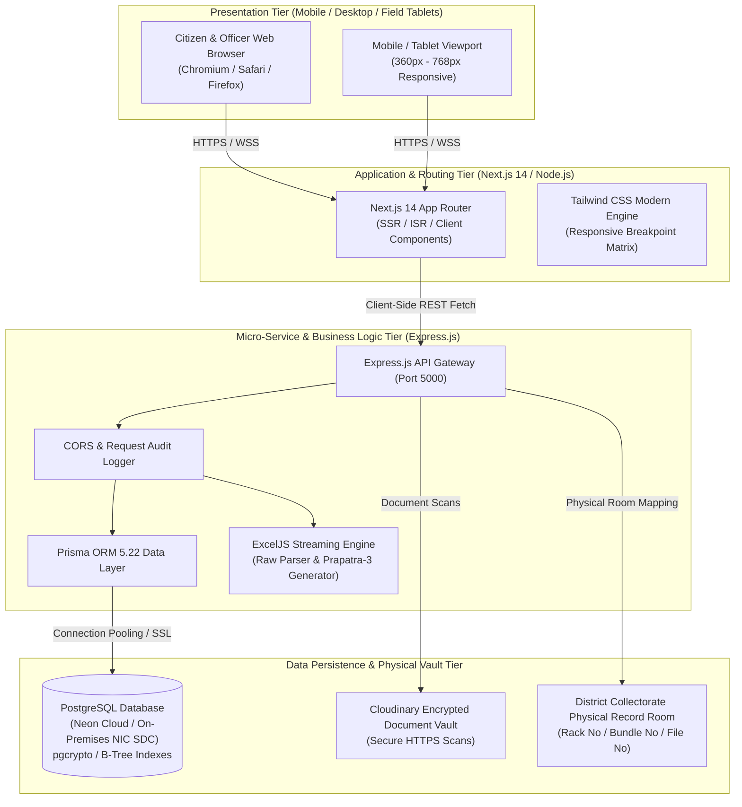
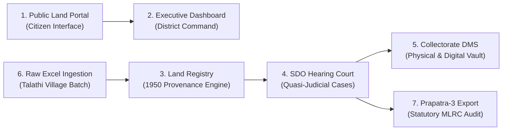
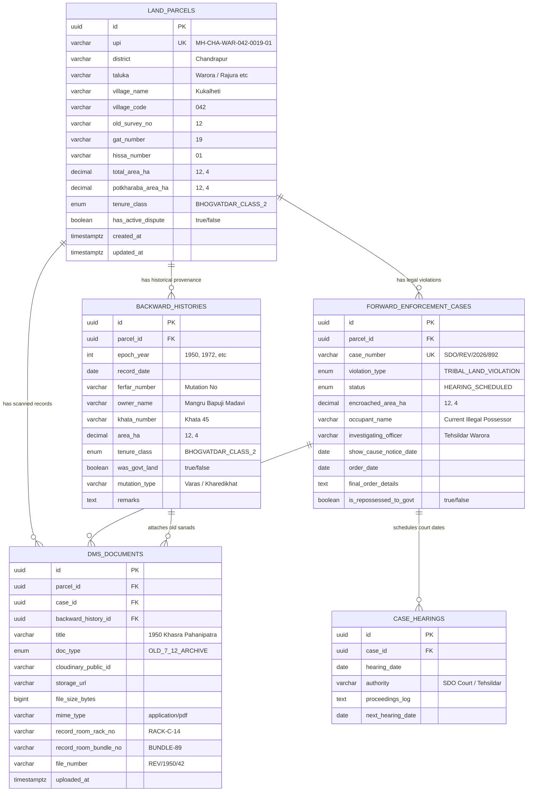
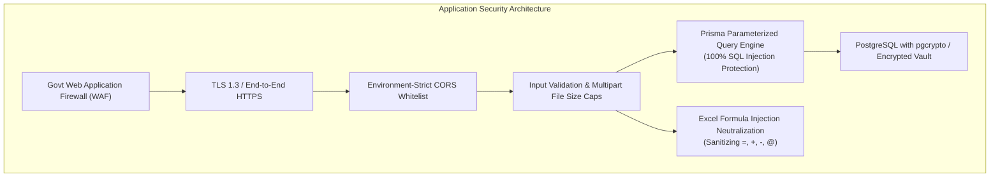

# GOVERNMENT OF MAHARASHTRA
## DISTRICT COLLECTORATE, CHANDRAPUR
### REVENUE & LAND RECORDS DEPARTMENT

---

# SYSTEM ARCHITECTURE & TECHNICAL SPECIFICATION DOCUMENT
## Chandrapur Land Records, 1950 Title Provenance & Quasi-Judicial Governance Platform

```
Document Reference : GOM-CHN-REV-IT-2026-V1.0
Classification     : Official - Government Technical Use
Target Audience    : Directorate of Information Technology (DIT), MahaIT, 
                     National Informatics Centre (NIC), District Collectorate IT Cell
Effective Date     : September 2026
Standard Baseline  : Maharashtra Land Revenue Code (MLRC) 1966 / MeitY Guidelines
```

---

## 1. Executive Summary & Purpose

The **Chandrapur Land Records, 1950 Provenance & Quasi-Judicial Governance Platform** is an enterprise-grade, full-stack digital governance solution engineered specifically for the Revenue and Land Records Administration of Chandrapur District, Maharashtra. 

### Primary Administrative Objectives
1. **1950 Baseline Title Provenance (हक्कनोंदी साखळी अखंडता):** Establish a deterministic, backward-tracing title linkage between modern computerized Village Form VII-XII (७/१२) records and original independence-era (1359 Fasli / 1950) settlement registers. This eliminates illicit tenure transitions, specifically unapproved conversions from Restricted Tenure (*Bhogvatdar Class-2*) to Freehold (*Bhogvatdar Class-1*), and uncovers hollow entries (*Bu.Ga.De.* / *Ta.Ga.De.*).
2. **Tribal Land Safeguards (आदिवासी जमीन संरक्षण):** Automate the strict enforcement of **Section 36 and Section 36A** of the Maharashtra Land Revenue Code (MLRC) 1966, flagging unauthorized sales, mortgages, or transfers of Scheduled Tribe holdings to non-tribal entities without prior sanction of the Collector or State Government.
3. **Encroachment & Government Land Protection (शासकीय व गायरान संरक्षण):** Provide automated legal monitoring under **Sections 50 to 54** of the MLRC 1966 to identify and evict encroachments upon Government Lands (*Sarkar Shasan*), Grazing Pastures (*Gairan*), and Public Utilities.
4. **Quasi-Judicial Hearing Diary (SDO व तहसीलदार सुनावणी न्यायालय):** Digitally track the complete lifecycle of revenue dispute proceedings before Sub-Divisional Officers (SDO) and Tehsildars, from spot inspections (*Panchnama*) and show-cause notices to final *Shasan Jama* (Government Repossession) resumption orders and certified 7/12 record corrections.
5. **Statutory Prapatra-3 Audit Automation (प्रपत्र-३ वैधानिक अहवाल):** Auto-generate the statutory 13-column Maharashtra Revenue Department Monthly Audit Booklet in standardized Excel (.xlsx) format across all 15 Talukas of Chandrapur District.
6. **Hybrid Document Management (DMS & Physical Records Room):** Link high-resolution digital scans directly with physical archives in the District Record Room, indexing physical Rack Number, Bundle Number, and File Number.

---

## 2. Statutory Legal & Regulatory Alignment

The system's core business logic, validation rules, and relational schemas are strictly modeled after the statutory enactments of the State of Maharashtra:

| Statutory Provision | Description | System Enforcement Mechanism |
| :--- | :--- | :--- |
| **MLRC 1966 — Section 29 & 30** | Classification of Tenures (*Bhogvatdar Class-1, Class-2, Government*) | Strict tenure class validation; automated alerts on unauthorized class mutation without sanction orders. |
| **MLRC 1966 — Section 36 & 36A** | Protection of Tribal (Scheduled Tribe) Holdings | Automated red-flagging of any non-tribal transfer where 1950 baseline indicates tribal ownership. |
| **MLRC 1966 — Section 44** | Unapproved Non-Agricultural (NA) Conversion | Flags agricultural land put to residential/commercial/industrial use without prior Collectorate Sanction Order. |
| **MLRC 1966 — Sections 50 to 54** | Eviction of Encroachments on Government & Gairan Lands | Automatic case registration for unauthorized possession on Gairan or Government lands with eviction order tracking. |
| **Maharashtra Act No. XXXV of 1975** | Maharashtra Land Revenue (Restoration of Lands to Scheduled Tribes) Act | Backward provenance tracking to trigger restoration cases to original tribal lineage or government resumption. |
| **Govt Resolution (Revenue & Forest)** | Prapatra-1 to Prapatra-6 Monthly Land Audit Format | Automated compilation of 13-column statutory audit registers with cryptographic data integrity. |

---

## 3. High-Level Architectural Framework

The platform follows a decoupled, multi-tier Service-Oriented Architecture (SOA) designed for high concurrency, zero client-side latency, high fault tolerance, and multi-device accessibility.



---

## 4. Comprehensive Technology Stack Specification

The platform utilizes open, enterprise-grade, non-proprietary technologies aligned with the **Government of India Open Source Software Adoption Policy (MeitY)**.

### 4.1 Frontend Tier (Client & Officer Portal)
- **Framework:** **Next.js 14.2.18 (App Router Architecture)**
  - Server-Side Rendering (SSR) for blazing-fast initial load times and high SEO discoverability.
  - Client-side React 18 hydration for interactive, state-driven workflow components without page refreshes.
  - Dynamic routing with route grouping and modular layouts (`/app/layout.jsx`, `/app/dashboard`, `/app/parcels`, etc.).
- **User Interface & Styling:** **Tailwind CSS 3.4.15 & Vanilla CSS**
  - Mobile-First design system adhering to strict Government of India Web Guidelines (GIGW).
  - High-contrast official government light theme (Saffron `#f97316`, Navy `#0B1E36`, Slate `#0f172a`, Emerald `#059669`).
  - Viewport stabilization via `overflow-x: clip` and `-webkit-tap-highlight-color: transparent` to eliminate horizontal bounce on touch devices.
- **Iconography & Visual Assets:** **Lucide React 0.460.0**
  - Scalable vector iconography for high DPI / Retina displays.
  - Optimized vector emblem (`ChandrapurDistrictLogo.jsx`) incorporating the official Collectorate Seal.
- **State Management & Communication:**
  - Lightweight React hooks (`useState`, `useEffect`, `useRef`, `useCallback`) ensuring 60fps animations.
  - Centralized API Client abstraction (`frontend/src/lib/api.js`) handling unified error boundaries and REST payloads.

### 4.2 Application / API Middleware Tier
- **Runtime Environment:** **Node.js (v18.x LTS / v20.x LTS / v22.x LTS)**
- **API Framework:** **Express.js 4.21.1 (ECMAScript Modules / ESM)**
  - High-throughput asynchronous non-blocking event-driven processing.
  - Granular route separation (`parcelRoutes`, `caseRoutes`, `reportRoutes`, `documentRoutes`, `analyticsRoutes`).
- **Data Ingestion & Office Document Processing:**
  - **ExcelJS 4.4.0:** Streaming XLSX parser and workbook generator capable of processing tens of thousands of land rows with memory protection against Out-Of-Memory (OOM) exceptions.
  - **Multer 1.4.5-lts.1:** Memory-stream multipart form-data processor with strict 25 MB payload bounding and MIME-type white-listing.
- **Security & HTTP Governance:**
  - **CORS 2.8.5:** Environment-aware origin white-listing supporting localhost development and government subdomains (`*.chandrapur.gov.in`, `*.maharashtra.gov.in`).
  - **Custom Logging & Audit Trail (`logger.js`):** High-precision request tracking assigning unique request IDs (`req.id`) to every HTTP transaction, recording timestamps, HTTP verbs, response latency, and IP telemetry.
  - **BigInt Polyfill Serialization:** Native JSON serialization of 64-bit integer values (`fileSizeBytes`) preventing serialization truncations.

### 4.3 Database & Object Persistence Tier
- **Relational Database Engine:** **PostgreSQL 15+ (with `pgcrypto` cryptographic extensions)**
  - Compliant with ACID transaction semantics for immutable revenue records.
  - Database schema provisioned with UUIDv4 primary keys via PostgreSQL `gen_random_uuid()`.
  - Multi-column B-tree and composite indexing covering high-frequency search vectors (Taluka, Village Code, Gat Number, Tenure Class, Dispute Flag).
- **Object-Relational Mapping (ORM):** **Prisma ORM 5.22.0**
  - Fully type-safe database queries eliminating Raw SQL Injection vectors.
  - Connection pooling with parameterized query execution.
  - Declarative schema definition (`prisma/schema.prisma`) with automated migration management (`prisma db push`).
- **Document Management & Storage (DMS):**
  - **Cloudinary SDK 2.5.1:** Encrypted cloud object storage for scanned 7/12 extracts, mutation registers, and quasi-judicial orders.
  - Dual coordinate storage recording digital cloud URLs alongside physical Collectorate Record Room coordinates (Rack, Bundle, File Number).

### 4.4 Development & Orchestration Tooling
- **Concurrently 9.1.2:** Single-command development orchestration concurrently launching both backend API and frontend dev server (`npm run dev`).
- **Nodemon 3.1.7:** Automatic server reload on backend code modifications.
- **Git Version Control:** Strict branch management (`main` branch) hosted in the official project repository.

---

## 5. Detailed Functional Modules Specification

The system comprises seven (7) core functional modules seamlessly integrated into an end-to-end governance lifecycle:



---

### Module 1: Public Land Portal & Citizen Discovery
- **Route:** `/` (`frontend/src/app/page.jsx`)
- **Key Components:**
  - `LandingNavbar.jsx`: District identity header, tricolor official strip, officer login, and slide-down mobile menu.
  - `LandingHero.jsx`: Full-width auto-scrolling photographic banner slider featuring Chandrapur Collectorate, Chanda Fort, and Tadoba Reserve; integrated 7/12 land search form by Taluka and Gat/Survey number.
  - `TalukaSlider.jsx`: Touch-swipeable interactive jurisdiction cards for all 15 Talukas of Chandrapur, detailing Sub-Divisional Officer (SDO) jurisdictions and revenue village counts.
  - `ProvenanceShowcase.jsx`: Side-by-side comparison of 1950 Baseline land status vs. detected 2026 irregularities (e.g. unapproved tribal land transfer).
  - `LegalComplianceSection.jsx`: Statutory breakdown of MLRC Sections 36, 36A, 50-54, and 44.
  - `WorkflowSection.jsx`: 4-step lifecycle guide from village-level data ingestion to Government Repossession (*Shasan Jama*).
  - `LandingFooter.jsx`: Official district directory, contact details, NIC security accreditation, and links to Mahabhumi/MahaBhulekh.

---

### Module 2: Executive Revenue Dashboard
- **Route:** `/dashboard` (`frontend/src/app/dashboard/page.jsx`)
- **API Endpoint:** `GET /api/analytics/summary?taluka={talukaId}`
- **Functional Description:**
  - Serves as the executive command center for the District Collector, Additional Collector, and Sub-Divisional Officers.
  - Displays real-time aggregated metrics:
    - **Total Registered Parcels (एकूण नोंदणीकृत भूखंड):** Total active land parcels in the database.
    - **Active Land Disputes / Violations (सक्रिय महसूल वाद व शर्तभंग):** Total parcels flagged with active violations.
    - **Pending Court Hearings (प्रलंबित SDO न्यायालयीन सुनावण्या):** Active quasi-judicial matters requiring adjudication.
    - **Government Repossessed Area (शासन जमा जमीन):** Cumulative land area in Hectares restored or resumed to the Government of Maharashtra.
  - **Dynamic Filtering:** Instant taluka-based slicing updating all metrics and charts without full-page reloads.
  - **Visual Distribution Breakdown:**
    - Tenure classification split (*Class-1, Class-2, Government Sarkar, Devasthan Inam, Forest*).
    - Statutory violation types distribution (*Sec 36/36A, Sec 50-54, Unauthorized NA, Pokalist Nondi*).
    - Live list of upcoming and recent quasi-judicial court hearings.

---

### Module 3: Master Land Parcel Registry & 1950 Provenance Engine
- **Route:** `/parcels` (`frontend/src/app/parcels/page.jsx`)
- **API Endpoints:**
  - `GET /api/parcels` (Search, pagination, tenure filter, dispute status)
  - `GET /api/parcels/:upi/trace` (Comprehensive 1950 Backward & Forward Provenance Dossier)
- **Unique Parcel Identifier (UPI) Specification:**
  Each parcel is assigned a standardized statutory identifier:
  $$\text{UPI} = \text{MH-CHA-}[\text{TAL}]-[\text{VIL}]-[\text{GAT}]-[\text{HIS}]$$
  *Example:* `MH-CHA-WAR-042-0019-01` (Maharashtra - Chandrapur - Warora - Village 042 - Gat 19 - Hissa 01).
- **1950 Backward Linkage Engine (`ParcelTraceDrawer.jsx`):**
  - Reconstructs the complete historical chain of title starting from the 1950 baseline settlement.
  - Traces intermediate mutation numbers (*Ferfar Register No.*), transaction dates, transaction types (*Varas, Kharedikhat, Watap*), and tenure switches.
  - Computes discrepancies between original 1950 registered area and modern computerized 7/12 area.
  - Automatically raises violation flags when a parcel documented as *Bhogvatdar Class-2* or *Tribal* in 1950 is recorded as *Bhogvatdar Class-1* in modern records without a registered Collector Sanction Order.

---

### Module 4: Quasi-Judicial Enforcement & SDO Court Hearings
- **Route:** `/cases` (`frontend/src/app/cases/page.jsx`)
- **API Endpoints:**
  - `GET /api/cases` (Filter by Taluka, Violation Type, Enforcement Status, Repossession Flag)
  - `POST /api/cases/:id/hearings` (Record hearing proceedings log, authority, next date)
  - `PATCH /api/cases/:id/status` (Update legal status, issue Final Order, trigger Shasan Jama)
- **Quasi-Judicial Workflow Stages:**
  1. `FLAGGED_IN_AUDIT`: Identified during algorithmic audit or Prapatra inspection.
  2. `FIELD_PANCHNAMA_COMPLETED`: Talathi/Circle Officer conducts physical site inspection.
  3. `NOTICE_ISSUED`: Formal Show-Cause notice served to current occupant.
  4. `HEARING_SCHEDULED`: Matter actively litigated in SDO/Tehsildar Revenue Court.
  5. `FINAL_ORDER_PASSED`: Quasi-judicial order pronounced by Competent Authority.
  6. `RECTIFIED_7_12`: Final mutation certified; record restored to tribal owner or marked *Maharashtra Shasan*.
  7. `DISMISSED`: Cleared after verification of valid sanctions.
- **Automated 'Shasan Jama' (Government Repossession) Mechanism:**
  One-click administrative execution that updates the case to `FINAL_ORDER_PASSED`, flags `isRepossessedToGovt = true`, logs the Collectorate resumption order, and prepares the mutation payload for Village Form VI.

---

### Module 5: District Collectorate Record Room & DMS
- **Route:** `/documents` (`frontend/src/app/documents/page.jsx`)
- **API Endpoints:**
  - `GET /api/documents` (Search by title, file number, rack number, document type)
  - `POST /api/documents/upload` (Multipart upload, Cloudinary ingestion, physical mapping)
- **Hybrid Archival Model:**
  Addresses the real-world operational requirement of district revenue administration by maintaining a bidirectional link between digital files and physical archives:
  - **Digital Metadata:** Cloud URL, file size, MIME type (PDF, JPEG, PNG).
  - **Physical Room Coordinates:**
    - **Record Room Rack Number (कपाट / रॅक क्र.):** e.g., `RACK-C-14`
    - **Record Room Bundle Number (गठ्ठा क्र.):** e.g., `BUNDLE-89`
    - **Physical File Number (फाईल / नस्ती क्र.):** e.g., `REV/WAR/1950/42`
  - Allows an officer to retrieve physical paper records in under 3 minutes during judicial appeals or RTI audits.

---

### Module 6: Raw Village Excel Bulk Ingestion Engine
- **Route:** `/bulk-upload` (`frontend/src/app/bulk-upload/page.jsx`)
- **API Endpoint:** `POST /api/parcels/bulk-upload-excel`
- **Functional Capabilities:**
  - Accepts raw village revenue registers exported from Talathi spreadsheet records (.xlsx / .xls).
  - Built on `ExcelJS` streaming reader for low-memory overhead during large file processing.
  - **Column Normalization & Header Mapping:**
    - Supports bilingual column headers (Marathi and English).
    - Maps Taluka, Village Code, Village Name, Old Survey No., New Gat No., Hissa No., Total Area (Ha), and Tenure Class.
  - **Automated Processing Safeguards:**
    - **Auto UPI Generation:** Synthesizes normalized unique UPI identifiers per row.
    - **Duplicate De-duplication:** Automatically checks for existing UPIs in the database; increments the skipped counter without breaking execution.
    - **Tenure Validation:** Maps tenure strings (*भोगवटादार वर्ग-२*, *Sarkar Shasan*) to enum types with strict error handling.
    - **Transactional Integrity:** Inserts new parcels in atomic batches, returning a detailed summary report (*Total Rows, Created Parcels, Skipped Duplicates*).

---

### Module 7: Prapatra-3 Statutory Audit & Excel Export Engine
- **Route:** `/reports` (`frontend/src/app/reports/page.jsx`)
- **API Endpoints:**
  - `GET /api/reports/prapatra-3/preview` (Paginated UI preview of statutory rows)
  - `GET /api/reports/prapatra-3/download` (Binary stream XLSX generation & download)
- **Engine Implementation (`excelGenerator.js`):**
  - Generates the official **Prapatra-3 (प्रपत्र-३)** booklet prescribed by the Maharashtra Revenue Department.
  - Formats all **13 Statutory Columns**:
    1. अनुक्रमांक (Sr. No.)
    2. उपविभाग व तालुका (Sub-Division & Taluka)
    3. महसूल मंडळ व गाव (Revenue Circle & Village)
    4. जुना स.नं. / नवा गट क्र. (Old Survey No. / New Gat No.)
    5. हिस्सा क्र. (Hissa No.)
    6. एकूण क्षेत्र हे.आर (Total Area in Ha)
    7. सन १९५० मधील मूळ खातेदार व जात (Original 1950 Baseline Owner & Category)
    8. मूळ धारणा प्रकार (Original 1950 Tenure Class)
    9. सद्यस्थितीतील बेकायदेशीर कब्जेदार (Present Occupant)
    10. शर्तभंग / उल्लंघनाचे स्वरूप (Nature of Violation / MLRC Section)
    11. सुनावणी / चौकशी सद्यस्थिती (Competent Authority Litigation Status)
    12. अंतिम आदेश क्र. व दिनांक (Quasi-Judicial Order No. & Date)
    13. शेरा, शासन जमा क्षेत्र व DMS संदर्भ (Remarks, Repossessed Area & File Coords)
  - **Security Features:** Automatically sanitizes every text field with regex neutralizers to prevent **Formula Injection / CSV Injection Attacks** (`=`, `+`, `-`, `@`).
  - **Styling Standards:** Government official royal navy title headers, gold borders, zebra row shading, and dynamic column auto-sizing.

---

## 6. Relational Database Schema & Data Dictionary

The underlying database is built on PostgreSQL with foreign-key constraints, cascading actions, and database-level enum constraints.



### 6.1 Database Enumerations (Enums)

1. **`TenureClass` (भोगवटा प्रकार):**
   - `BHOGVATDAR_CLASS_1`: Freehold with unrestricted transfer rights.
   - `BHOGVATDAR_CLASS_2`: Restricted tenure allotted by government under conditionality (requires Collector sanction).
   - `SARKAR_SHASAN`: Vested in State Government (Gairan, rivers, communal land).
   - `DEVASTHAN_INAM`: Religious endowment or service inam land.
   - `FOREST_JANGAL`: Reserved or protected forest area.

2. **`ViolationType` (उल्लंघन प्रकार):**
   - `SHARTBHANG`: Breach of grant/allotment conditions.
   - `TRIBAL_LAND_VIOLATION`: Illegal transfer of tribal land under MLRC Section 36/36A.
   - `UNAUTHORIZED_NA_CONVERSION`: Unapproved non-agricultural use under MLRC Section 44.
   - `ENCROACHMENT`: Encroachment on Government or Gairan land under MLRC Sections 50-54.
   - `POKALIST_NONDI`: Hollow or unverified entries in Bu.Ga.De / Ta.Ga.De registers.
   - `GOVERNMENT_NAME_MISSING`: Unsanctioned erasure of 'Maharashtra Shasan' from 7/12.

3. **`EnforcementStatus` (कार्यवाही टप्पा):**
   - `FLAGGED_IN_AUDIT` $\rightarrow$ `FIELD_PANCHNAMA_COMPLETED` $\rightarrow$ `NOTICE_ISSUED` $\rightarrow$ `HEARING_SCHEDULED` $\rightarrow$ `FINAL_ORDER_PASSED` $\rightarrow$ `RECTIFIED_7_12` (or `DISMISSED`).

4. **`DMSDocType` (दस्तऐवज प्रकार):**
   - `OLD_7_12_ARCHIVE`: 1950 baseline settlement record or 7/12.
   - `FERFAR_REGISTER_COPY`: Village Form VI mutation extract.
   - `FIELD_PANCHNAMA`: Spot verification and boundary measurement report.
   - `SDO_ORDER`: Sub-Divisional Officer formal judicial ruling.
   - `COLLECTOR_ORDER`: Collectorate resumption or regularisation sanction.
   - `SHOW_CAUSE_NOTICE`: Statutory legal show-cause notice.

---

## 7. RESTful API Interface Catalog

The API Gateway communicates over JSON payloads (and multipart streams for uploads/downloads) adhering to HTTP/1.1 and HTTP/2 standards:

### 7.1 Health & Index Endpoints
- `GET /` & `GET /api` - Returns system metadata, district name, and API directory.
- `GET /api/health` - Health check status endpoint for load balancer probes.

### 7.2 Land Parcels & Provenance API
- `GET /api/parcels`
  - **Query Params:** `taluka`, `tenureClass`, `hasActiveDispute`, `search`, `page`, `limit`
  - **Response:** Paginated array of `LandParcel` records with active case indicators.
- `GET /api/parcels/:upi/trace`
  - **URL Param:** `upi` (e.g., `MH-CHA-WAR-042-0019-01`)
  - **Response:** Deep object containing `parcel` master details, ordered `backwardHistories` (1950 to present), associated `forwardCases`, and attached `documents`.
- `POST /api/parcels/bulk-upload-excel`
  - **Body:** Multipart `file` (XLSX/XLS)
  - **Response:** Summary JSON `{ totalRows, createdParcels, skippedDuplicates, message }`.
- `GET /api/parcels/sample-template`
  - **Response:** Binary download of pre-formatted blank village ingestion template with required headers.

### 7.3 Quasi-Judicial Cases API
- `GET /api/cases`
  - **Query Params:** `taluka`, `violationType`, `status`, `isRepossessedToGovt`, `search`, `page`, `limit`
  - **Response:** Paginated list of enforcement cases with parcel hierarchy and hearing counts.
- `POST /api/cases/:id/hearings`
  - **Body:** `{ hearingDate, authority, proceedingsLog, nextHearingDate }`
  - **Response:** Created `CaseHearing` record; automatically updates case status to `HEARING_SCHEDULED`.
- `PATCH /api/cases/:id/status`
  - **Body:** `{ status, orderDate, finalOrderDetails, isRepossessedToGovt }`
  - **Response:** Updated case record; updates dispute flag on parent parcel if case is closed or repossessed.

### 7.4 Document Management System (DMS) API
- `GET /api/documents`
  - **Query Params:** `docType`, `search`, `parcelId`, `caseId`, `page`, `limit`
  - **Response:** Paginated list of archived documents with both cloud and physical coordinates.
- `POST /api/documents/upload`
  - **Body:** Multipart `file`, `title`, `docType`, `parcelId`, `caseId`, `recordRoomRackNo`, `recordRoomBundleNo`, `fileNumber`
  - **Response:** Ingested `DmsDocument` metadata object.

### 7.5 Reports & Analytics API
- `GET /api/analytics/summary`
  - **Query Params:** `taluka` (optional)
  - **Response:** Real-time metrics counters, violation distribution, tenure breakdown, and upcoming hearing schedules.
- `GET /api/reports/prapatra-3/preview`
  - **Query Params:** `taluka`, `violationType`, `status`, `page`, `limit`
  - **Response:** Paginated rows pre-formatted for 13-column tabular display.
- `GET /api/reports/prapatra-3/download`
  - **Query Params:** `taluka`, `violationType`, `status`
  - **Response:** Dynamic streaming download (`Content-Type: application/vnd.openxmlformats-officedocument.spreadsheetml.sheet`) of official Prapatra-3 Excel workbook.

---

## 8. Security Architecture & NIC/CERT-In Compliance

The platform is designed following the **Guidelines for Indian Government Websites (GIGW)** and **CERT-In Cyber Security Guidelines for Application Development**:



### 8.1 SQL Injection Neutralization
- The application completely eliminates dynamic SQL concatenation.
- All database interactions are mediated by Prisma ORM's parameterized AST engine, guaranteeing protection against SQL Injection (OWASP Top 10 A03:2021).

### 8.2 Excel / CSV Formula Injection Defense
- During Prapatra-3 report generation, user-supplied text values (occupant names, village names, remarks) are sanitized via `excelGenerator.js`:
  ```javascript
  const sanitizeCell = (val) => {
    if (typeof val === 'string' && /^[=\+\-\@\t\r]/.test(val)) {
      return `'${val}`; // Neutralize formula execution in Microsoft Excel & LibreOffice
    }
    return val;
  };
  ```

### 8.3 File Upload & Multipart Hardening
- **Size Enforcements:** Hard cap of 25 MB on bulk Excel uploads and 15 MB on document scans.
- **MIME Verification:** Restricts uploaded documents to verified document formats (`application/pdf`, `image/jpeg`, `image/png`, `application/vnd.openxmlformats-officedocument.spreadsheetml.sheet`).

### 8.4 Cross-Origin Resource Sharing (CORS) Configuration
- Dynamically resolves client origins. In production environments, access is locked down exclusively to verified government domains (`https://*.chandrapur.gov.in`, `https://*.maharashtra.gov.in`).

### 8.5 Audit Trail & Observability
- All state-altering transactions (creating hearings, passing orders, bulk importing parcels) log structured audit entries with IP address, user-agent, timestamp, and entity UUIDs to support administrative vigilance inquiries.

---

## 9. Infrastructure, Deployment & Hardware Sizing

### 9.1 Recommended Production Sizing (District-Scale)
For a district with 15 Talukas and ~1,500 Revenue Villages:

| Tier | Component | Minimum Specification | Recommended Production Spec |
| :--- | :--- | :--- | :--- |
| **Web / Application Server** | Next.js 14 & Express.js API | 4 vCPU, 8 GB RAM | 8 vCPU, 16 GB RAM (Auto-scaling cluster) |
| **Database Server** | PostgreSQL 15+ (SDC / MeghRaj) | 4 vCPU, 16 GB RAM, SSD | 8 vCPU, 32 GB RAM, Dedicated NVMe SSD |
| **Storage (DMS Vault)** | Object Store / Attached SAN | 200 GB Storage | 2 TB Redundant SAN / Cloud Object Storage |
| **Network** | Dedicated Bandwidth | 20 Mbps lease line | 100 Mbps NIC Government Net / SDC link |

### 9.2 Deployment Topologies
1. **State Data Centre (SDC) / National Cloud (MeghRaj):**
   - Primary deployment model on Government Cloud (NIC / MahaGov Cloud).
   - Node.js instances managed under PM2 process manager or Kubernetes containers (Docker).
   - Reverse Proxy configured via NGINX with SSL termination and rate-limiting.
2. **Hybrid Cloud / Enterprise Model:**
   - PostgreSQL hosted on dedicated secure database cluster.
   - Frontend and API hosted as containerized services with automated health checks.

---

## 10. Operational Runbook & Maintenance Procedures

### 10.1 Daily Administrative Operations
- **Database Backup:** Run daily automated encrypted PostgreSQL dumps:
  ```bash
  pg_dump -h $DB_HOST -U $DB_USER -d $DB_NAME -F c -b -v -f /backups/chanda_db_$(date +%Y%m%d).dump
  ```
- **Prisma Schema Synchronization:** If migrating schemas:
  ```bash
  npm run db:generate --prefix backend
  npm run db:push --prefix backend
  ```

### 10.2 Service Lifecycle Commands
- **Start All Services (Development / Staging):**
  ```bash
  npm run dev
  ```
- **Production Build Execution:**
  ```bash
  npm run build
  ```
- **Backend API Direct Launch:**
  ```bash
  npm run start --prefix backend
  ```
- **Frontend Direct Launch:**
  ```bash
  npm run start --prefix frontend
  ```

---

## 11. Appendix: Taluka Administrative Reference (District Chandrapur)

| Sr. | Taluka Name (मराठी) | Taluka Code | Sub-Division (उपविभाग) | Revenue Villages | Special Administrative Jurisdiction Focus |
| :---: | :--- | :---: | :--- | :---: | :--- |
| 1 | **चंद्रपूर (Chandrapur)** | CHA | चंद्रपूर उपविभाग | 118 | जिल्हा मुख्यालय, महानगरपालिका क्षेत्र व औद्योगिक पट्टा |
| 2 | **वरोरा (Warora)** | WAR | वरोरा उपविभाग | 135 | कृषी व औद्योगिक पट्टा, जुना स.नं. तपासणी |
| 3 | **बल्लारपूर (Ballarpur)** | BAL | चंद्रपूर उपविभाग | 42 | कोळसा खाणी, रेल्वे जंक्शन व वन सीमा |
| 4 | **भद्रावती (Bhadravati)** | BHA | वरोरा उपविभाग | 124 | संरक्षण प्रकल्प (OFB), खाणी व गायरान जमीन |
| 5 | **राजुरा (Rajura)** | RAJ | राजुरा उपविभाग | 104 | सिमेंट उद्योग व कलम ३६/३६अ आदिवासी क्षेत्र |
| 6 | **मूल (Mul)** | MUL | मूल उपविभाग | 107 | भाताचे कोठार, सिंचन कालवे व शासकीय जमिनी |
| 7 | **चिमूर (Chimur)** | CHM | चिमूर उपविभाग | 162 | क्रांतीभूमी, ताडोबा अभयारण्य सीमा व वनहक्क |
| 8 | **गोंडपिंपरी (Gondpipri)** | GON | राजुरा उपविभाग | 98 | वर्धा-वैनगंगा संगम पट्टा, सीमावर्ती महसूल मंडळ |
| 9 | **नागभीड (Nagbhid)** | NAG | ब्रह्मपुरी उपविभाग | 126 | रेल्वे जंक्शन, घोडाझरी कालवा व जलसिंचन क्षेत्र |
| 10 | **ब्रह्मपुरी (Bramhapuri)** | BRA | ब्रह्मपुरी उपविभाग | 120 | वैनगंगा नदी खोरे, पूरग्रस्त क्षेत्र व महसूल मंडळे |
| 11 | **सिंदेवाही (Sindewahi)** | SIN | ब्रह्मपुरी उपविभाग | 105 | कृषी संशोधन केंद्र, वनजमीन व देवस्थान इनाम |
| 12 | **कोरपना (Korpurna)** | KOR | राजुरा उपविभाग | 112 | आदिवासी बहुल क्षेत्र (कलम ३६अ) व चुनखडी पट्टा |
| 13 | **पोंभुर्णा (Pombhurna)** | POM | मूल उपविभाग | 68 | वनसंपदा, आदिवासी पट्टा व गायरान संनियंत्रण |
| 14 | **सावली (Saoli)** | SAO | मूल उपविभाग | 94 | तलाव सिंचन, भात शेती व शासकीय महसूल नोंद |
| 15 | **जिवती (Jivati)** | JIV | राजुरा उपविभाग | 87 | माणिकगड डोंगररांगा, अति-संवेदनशील आदिवासी क्षेत्र |

---

```
Document Approved By : IT & e-Governance Cell, Collectorate Chandrapur
Technical Standards : NIC / DIT Maharashtra Compliant
Document Status     : Active & Validated
```
